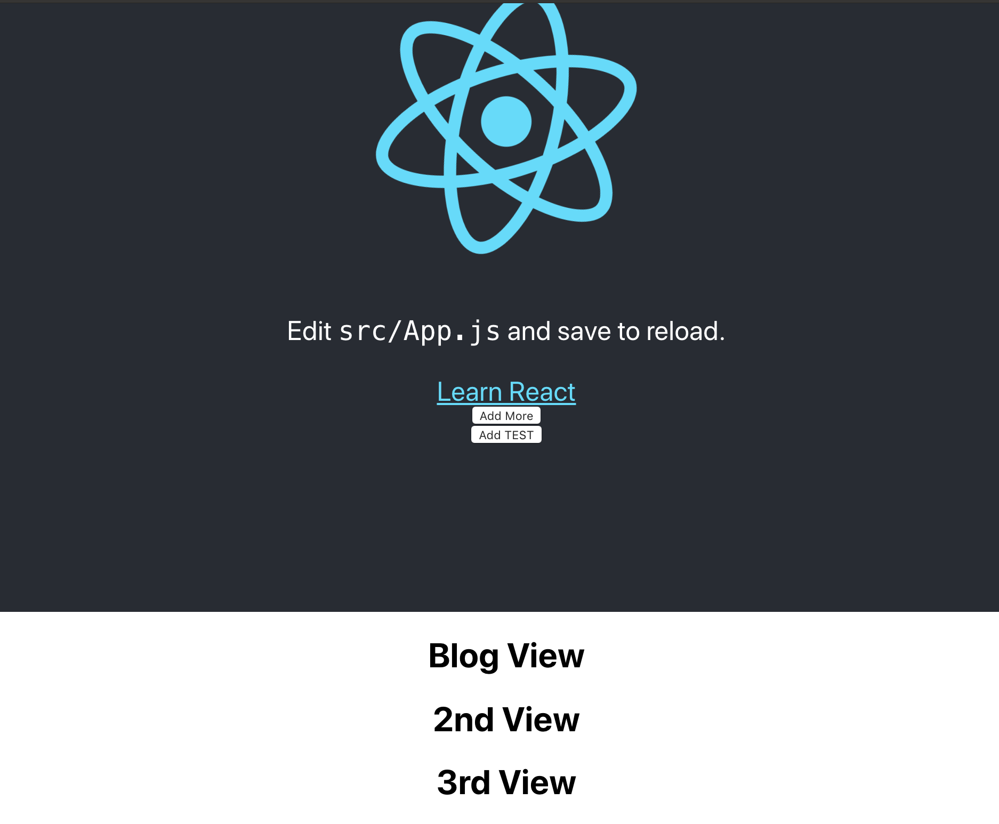
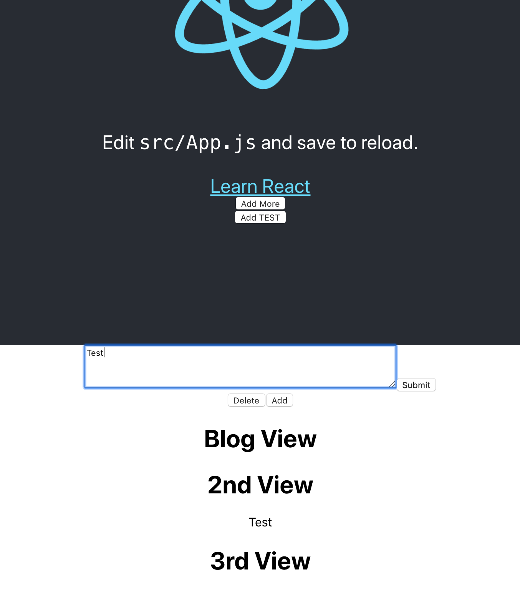

# Medium CMS Editor
> Cheap mockup of Medium's CMS editor.

<!-- [![NPM Version][npm-image]][npm-url]
[![Build Status][travis-image]][travis-url]
[![Downloads Stats][npm-downloads]][npm-url] -->

This is a project where I learned a great deal from.  I wanted to see if I could clone Medium's CMS or the editor.  I really did not have a path to follow before I began.  It was approached in a very hacky way.  I was
essentially just trying to tweak things here and there while at the same time learning how things worked. I googled a whole bunch.  

## Screenshots
Click on any of the buttons to add a textarea input.


***
Add text and then click submit then click either "Add More", "Add TEST", "Delete", or "Add".


***

## Installation
Download the zip, unzip, then on terminal cd into root directory and run the following command to get it up and running.  Nothing too complicated.

OS X, Linux & Windows:

```sh
npm start
```


## Usage example

Just click on any of the buttons on the site and type in the text input areas and see how they affect
the webpage.   


## Contact

Distributed under the MIT license. See ``LICENSE`` for more information.

[My Website][(https://jzapata87.github.io/)]


<!-- Markdown link & img dfn's -->
[npm-image]: https://img.shields.io/npm/v/datadog-metrics.svg?style=flat-square
[npm-test]: 
[npm-url]: https://npmjs.org/package/datadog-metrics
[npm-downloads]: https://img.shields.io/npm/dm/datadog-metrics.svg?style=flat-square
[travis-image]: https://img.shields.io/travis/dbader/node-datadog-metrics/master.svg?style=flat-square
[travis-url]: https://travis-ci.org/dbader/node-datadog-metrics
[wiki]: https://github.com/yourname/yourproject/wiki
